# dsh-users-platform

> **English (primary): [README.md](README.md)** ｜ **[中文文档](README.zh-CN.md)（当前）**

**DSH 用户平台** · **DSH Users Platform**

在公网**安全托管** [DeepSeek Harness](https://github.com/deepseek-ai/deepseek-harness)（DSH）：用户自助注册、管理员审核，各自获得一套**独立实例**与文件根。

[](https://nodejs.org/)
[](#版本更新说明)
[](https://github.com/deepseek-ai/deepseek-harness)
[](manual/project.zh-CN.md#项目如何建成)
[](manual/project.zh-CN.md)

重点不在「多租户」本身，而在 **DSH 进入托管环境后暴露的三个硬问题**：

1. **进程级安全隔离** —— 一人一账号、一人一实例，叠加端口守卫与出网护栏；
2. **故障自愈** —— 崩溃、被回收、会话过期都能自动恢复，用户无感；
3. **插件与技能受控管理** —— 导入即预检，启用可回滚、可隔离、可限内存。

**基于并验证于 DeepSeek Harness `0.1.5-rc.1`** —— [deepseek-ai/deepseek-harness](https://github.com/deepseek-ai/deepseek-harness)（MIT）。

**人负责规划与关键判断，AI 负责实施**（DeepSeek **V4 / V4.1 flash**）—— 见[项目如何建成](manual/project.zh-CN.md#项目如何建成)。

## 文档地图

本页只保留核心内容，细节都在下面这些文档里。

| 文档 | 内容 |
|---|---|
| **[manual/highlights.zh-CN.md](manual/highlights.zh-CN.md)** | 六组设计要点详解（隔离 · 自愈 · 插件治理 · 模型 · 可测 · 运维） |
| **[manual/architecture.zh-CN.md](manual/architecture.zh-CN.md)** | 基座、请求链路、自愈链路、部署形态、目录结构 |
| **[manual/installation.zh-CN.md](manual/installation.zh-CN.md)** | 前置条件、DNS 与证书、两种部署方式对比、`nip.io` 演练、手动开发部署、**关于域名的全部内容** |
| **[manual/configuration.zh-CN.md](manual/configuration.zh-CN.md)** | 全部环境变量、默认值与坑 |
| **[manual/security.zh-CN.md](manual/security.zh-CN.md)** | 安全模型（逐面） |
| **[manual/api.zh-CN.md](manual/api.zh-CN.md)** | 控制面 API 分组与权限 |
| **[manual/faq.zh-CN.md](manual/faq.zh-CN.md)** | 真正会遇到的六个问题 |
| **[manual/project.zh-CN.md](manual/project.zh-CN.md)** | 开发、贡献、版本、人与 AI 分工 |
| **[manual/decisions.zh-CN.md](manual/decisions.zh-CN.md)** | 关键决策与决策时间线、技术路线与选型、上下文与接续机制、开发过程产出的文档、AI 的自决边界 |
| **[PLUGIN-PORTING.zh-CN.md](PLUGIN-PORTING.zh-CN.md)** | 把插件改造成平台可用 —— 六个失败模式、五条规范、完整实战 |
| **[examples/dsh-univer-office/](examples/dsh-univer-office/)** | 该实战的改造补丁、新增模块与配套技能 |
| **[install.zh-CN.md](install.zh-CN.md)** | 写给 AI agent 执行的分步安装指令 |
| **[AGENTS.zh-CN.md](AGENTS.zh-CN.md)** | 在本仓库改代码的 agent 的纪律 |

每份文档都有英文主文档（`*.md`）。

## 亮点

七组主题，各一句话：

| # | 主题 | 一句话 |
|---|---|---|
| 1 | **进程级安全隔离** | 一人一个确定性 uid、一人一个实例，叠加端口守卫与出网护栏 —— 隔离是**内核边界**，不是文件权限约定 |
| 2 | **故障自愈** | 崩溃熔断、按需守护实例修复、被回收与会话过期后无感恢复 |
| 3 | **插件与技能受控管理** | 导入即预检，启用走「探活 + 快照回滚 + 逐插件隔离」，启用前还有内存预估 |
| 4 | **模型与访问面** | 平台自己写凭据（官方模型页在托管环境必失效），并读实例自带的厂家目录；访问可用子路径 / 子域 / 自定义域名 |
| 5 | **可测与可回归** | 关键决策都是纯函数，不起实例就能推演行为 |
| 6 | **部署与运维** | 一键部署、幂等可预演、反代自适应 |
| 7 | **集群模式** | 控制面可拆成「管理节点 + 若干工作节点」：归属由 **Postgres 里的原子租约**裁定，每次写入带 epoch，工作节点沿用单机那套 spawner —— **加机器不改变隔离语义** |

👉 **详见 [manual/highlights.zh-CN.md](manual/highlights.zh-CN.md)**

## 架构

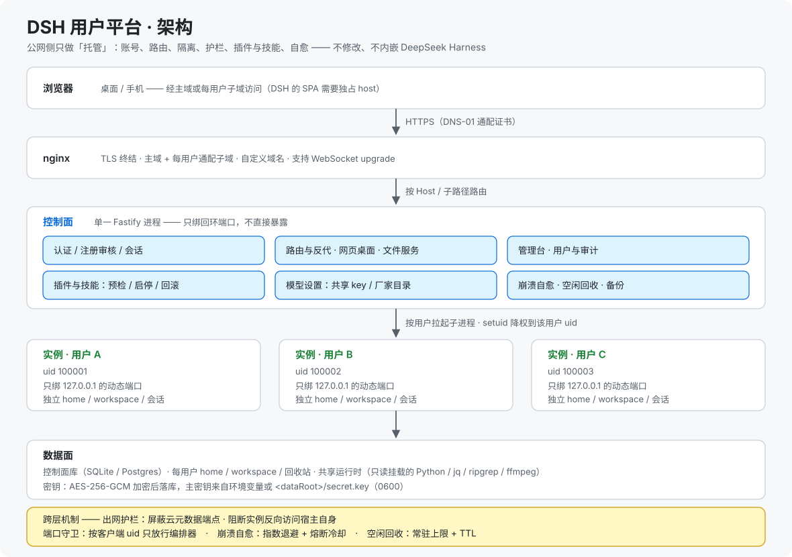

基座是 [DeepSeek Harness](https://github.com/deepseek-ai/deepseek-harness)（`dsh`，当前版本 **`0.1.5-rc.1`**），它默认是「**本机单用户**」形态。本项目**不修改、不内嵌**它的代码 —— 只在外面套一层托管平台，按用户各拉起一个 `dsh` 子进程。

**请求链路**：浏览器 → nginx（TLS）→ 控制面（认证 / 审核 / 管理面 / 网页桌面）→ 按 `Host` 或 `/u/<userId>/dsh/*` 路由 → 用户实例（只绑回环）。
**自愈链路**：崩溃 → 按需拉起守护实例修一次 profile → 自动重启；反复崩溃则退避 + 熔断。

### 集群模式

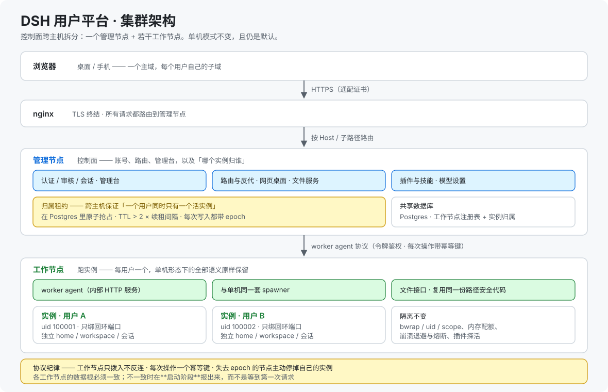

上面那种单机部署**仍是默认**；集群模式把它拆到多台主机上，**而用户得到的东西不变**：

| 部件 | 它做什么 |
|---|---|
| **归属租约** | 「一个用户同时只有一个活实例」由 **Postgres 里的原子抢占**裁定 —— 单机模式靠进程内 Map 天然拿到这个保证。租约带 TTL 与定时续租，每次写入都盖 **epoch**，归属始终唯一明确 |
| **worker agent** | 工作节点上的被拨入口（令牌鉴权），暴露实例生命周期与文件操作。它**复用单机那套 spawner 与同一份路径安全代码**，所以 bwrap / uid / scope 隔离、内存配额、崩溃退避与熔断、插件探活的行为完全一致；工作节点向管理节点拨入，只接受白名单动作且参数受限 |
| **共享数据库** | 工作节点注册表 + 实例归属（`host_id` / `epoch` / `lease_until`） |
| **一条基线** | 各工作节点使用**同一个绝对数据根**，实例的路径在任何一台机器上含义一致 |

👉 **详见 [manual/architecture.zh-CN.md](manual/architecture.zh-CN.md)**

## 功能

> 每个模块一张表 + 一张界面截图 —— **全仓库的 9 张运行截图都在这一节**。
> 机制与取舍见 [亮点](manual/highlights.zh-CN.md)。

管理面集中在设置面板的「系统管理」里，按功能分入口：

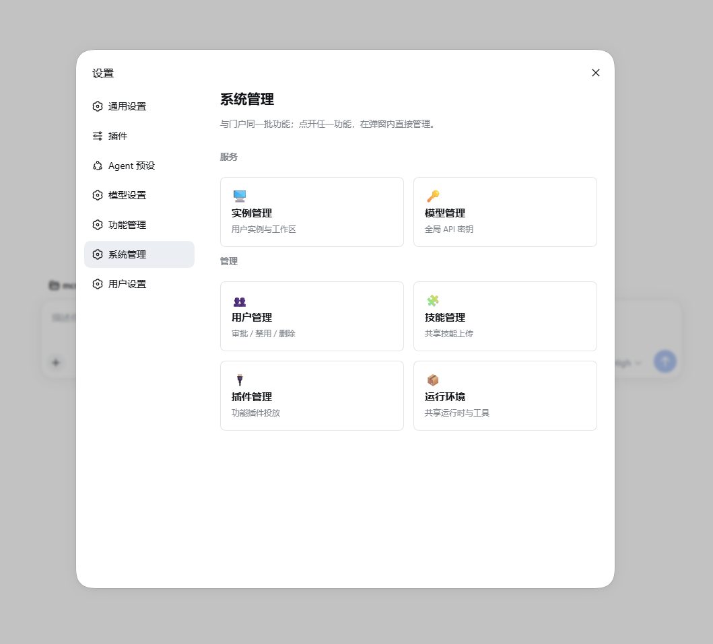

### 账号与门户

| 功能 | 说明 |
|---|---|
| 注册与审核 | 首位管理员由 `bootstrap-admin` 创建；新用户注册后需审核通过才能登录 |
| 用户管理 | 通过 / 禁用 / 删除（级联清理会话、实例与目录）；管理员可一键直达 DSH 会话 |
| 会话与登录 | 不透明随机 token（仅 SHA-256 哈希落库）；单活跃会话 + 本地空闲回收 |
| 网页桌面 | 文件浏览 / 新建 / 上传 / 下载；按文件夹启动 DSH；路径双重围栏 |

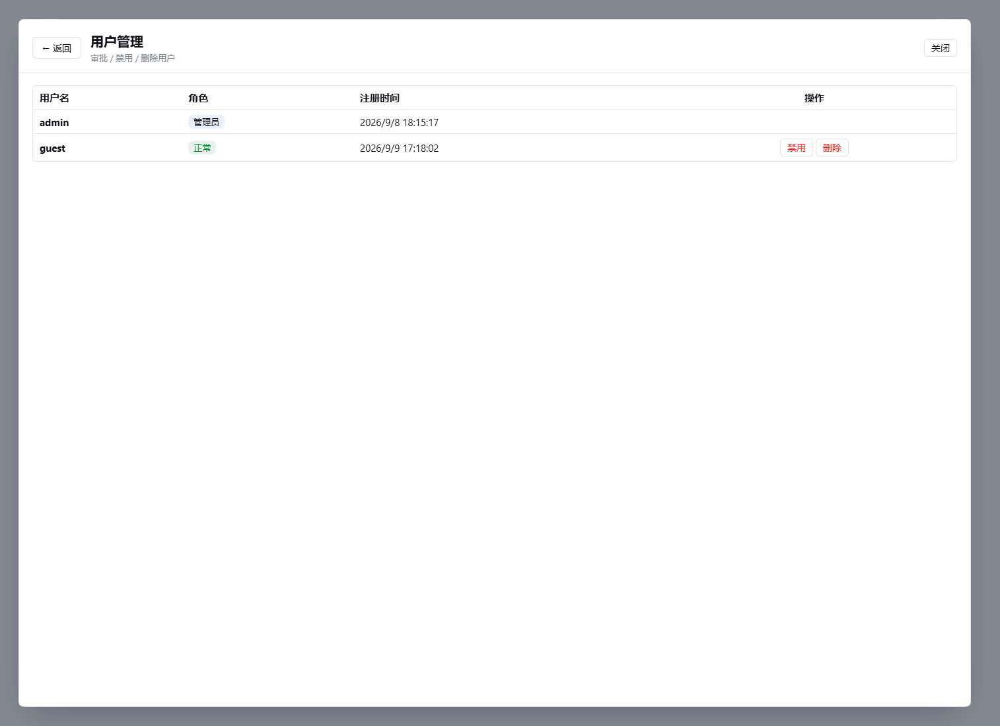

### 实例与运行环境

| 功能 | 说明 |
|---|---|
| 每用户隔离 | 独立 DSH 实例：软隔离 → 账号级硬隔离 → 端口守卫 |
| 崩溃自愈 | 崩溃检测 → 按需守护实例修复 → 自动重启；含退避、熔断与观测 |
| 回收后自愈 | 回页面自动唤醒重建连接；导航走过渡页、XHR 等就绪再转发、401 透明重放 |
| 会话过期自愈 | 实例 HTML 注入自愈脚本，无需手动刷新 |
| 共享运行时 | 可移植 Python 3.12 与 jq / ripgrep / ffmpeg 静态工具；版本基线冻结 + 漂移巡检 |
| 出网护栏 | 屏蔽云元数据端点、阻断实例主动访问宿主自身、观测新建外联 |
| 内存治理 | 每实例 V8 堆限可调 + 采样告警 + 分解探针 |

实例被回收后再打开，看到的是一个**会自动恢复**的过渡页：

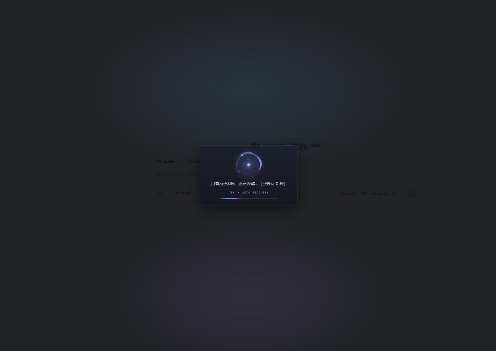

共享运行时（实例内 `/usr` 为只读挂载，装了什么一目了然）：

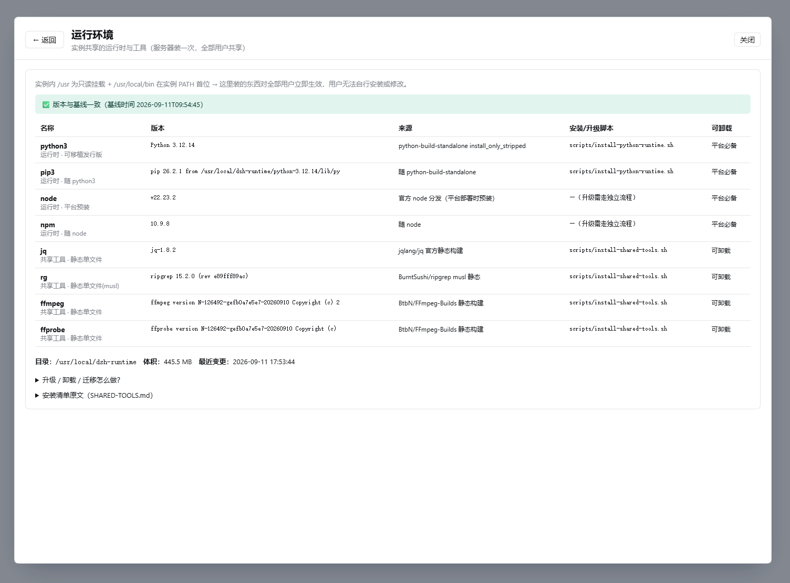

### 插件与技能

| 功能 | 说明 |
|---|---|
| 候选池 | 管理员导入（官方目录白名单 / 上传 tgz）；用户在实例内自助启停 |
| 兼容性预检 | 依赖范围 + 导出符号双判据；不兼容默认拒投并回显依据 |
| 启停安全 | 探活 + 快照回滚 + 逐插件隔离标记，不兼容插件不会把实例拖进崩溃循环 |
| 内存预估 | 预估徽章与状态条；超单实例上限时拦截并要求确认 |
| provider 联动 | 启停后按当前 bundles 重算 dsh-web 的 search provider，避免多 provider 冲突 |
| 技能管理 | 共享技能 + 个人技能上传 / 列表 / 启停；zip 两阶段替换，含 symlink 穿透与 zip bomb 防护 |

插件管理（官方推荐目录，可整表重拉）：

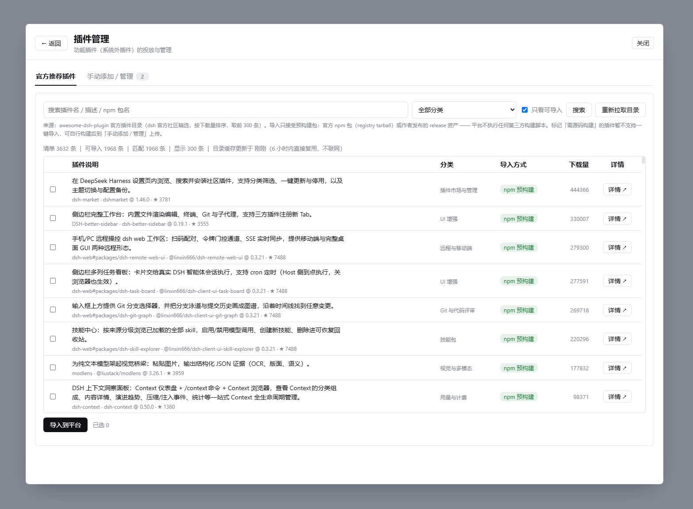

批次内存占用与**逐插件**预估在同一个面板里给出，超单实例上限时拦截：

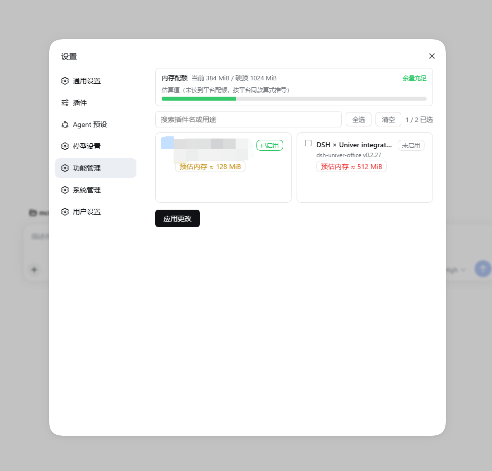

技能管理（共享技能对所有用户只读可用）：

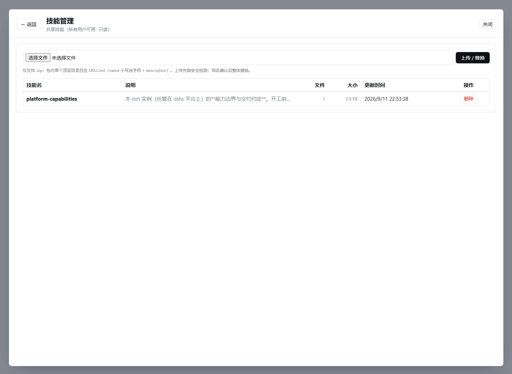

### 模型与凭据

| 功能 | 说明 |
|---|---|
| 模型条目 | 内置 DeepSeek + 官方厂家目录 + 自定义 OpenAI 兼容网关；每条可单独启用 / 停用 / 切换 |
| 官方厂家目录 | 读实例所用的同一个 `pi-ai` 包（当前 39 个厂家），选中只需填 API Key |
| 落地方式 | 平台把「已启用」条目写进实例的 `.credentials.yaml` 与 `settings.yaml`，只动平台自己写过的条目 |
| 共享模型 | 管理员可开共享 key，用户无需自备即可开始 |
| 密钥安全 | AES-256-GCM 静态加密；用户自配时不注入平台共享 env；切换后实例自动重启生效 |

平台共享模型与用户自有条目在**同一个面板**里管理，每条可单独启停：

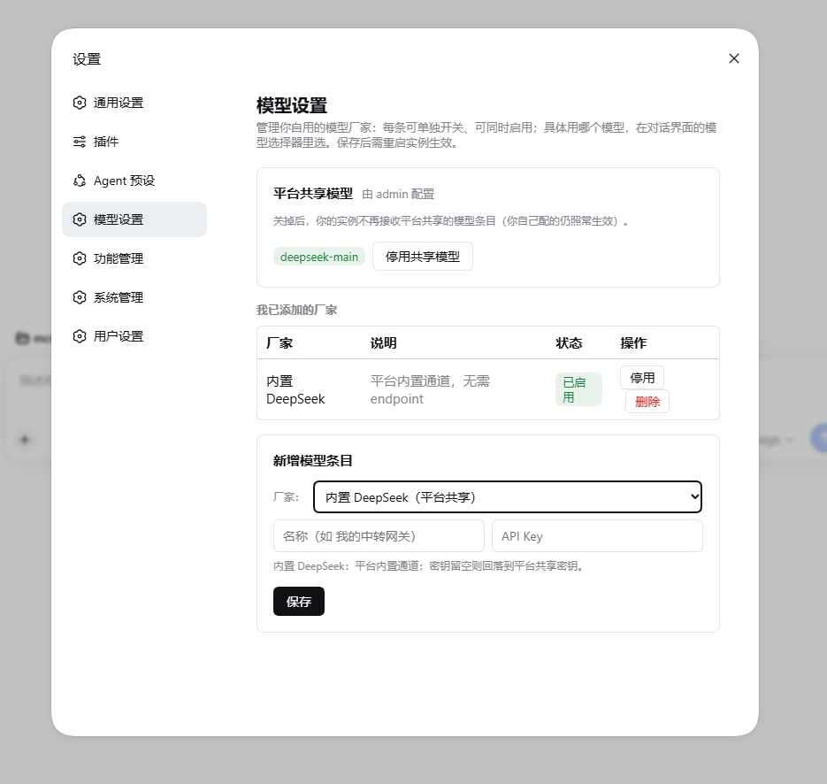

### 访问形态与运维

| 功能 | 说明 |
|---|---|
| 多形态访问 | 子路径 `/u/<userId>/dsh/` ｜ 每用户子域 `<用户名>.<主域>`（HTTP + WebSocket）｜ 自定义域名 |
| 存储与清理 | 每用户存储用量上报；会话保留期回收 / 工作区清理 / 回收站清理三件套 |
| 备份 | 平台一键备份（SQLite 一致性快照 + 配置 + 产物） |
| 审计 | 注册 / 登录 / 审核 / 改密钥 / 插件投放等写入 `audit_log` |
| DSH 对话 | 用户最终拿到的完整对话界面（对话 + 工具调用 + 插件技能） |

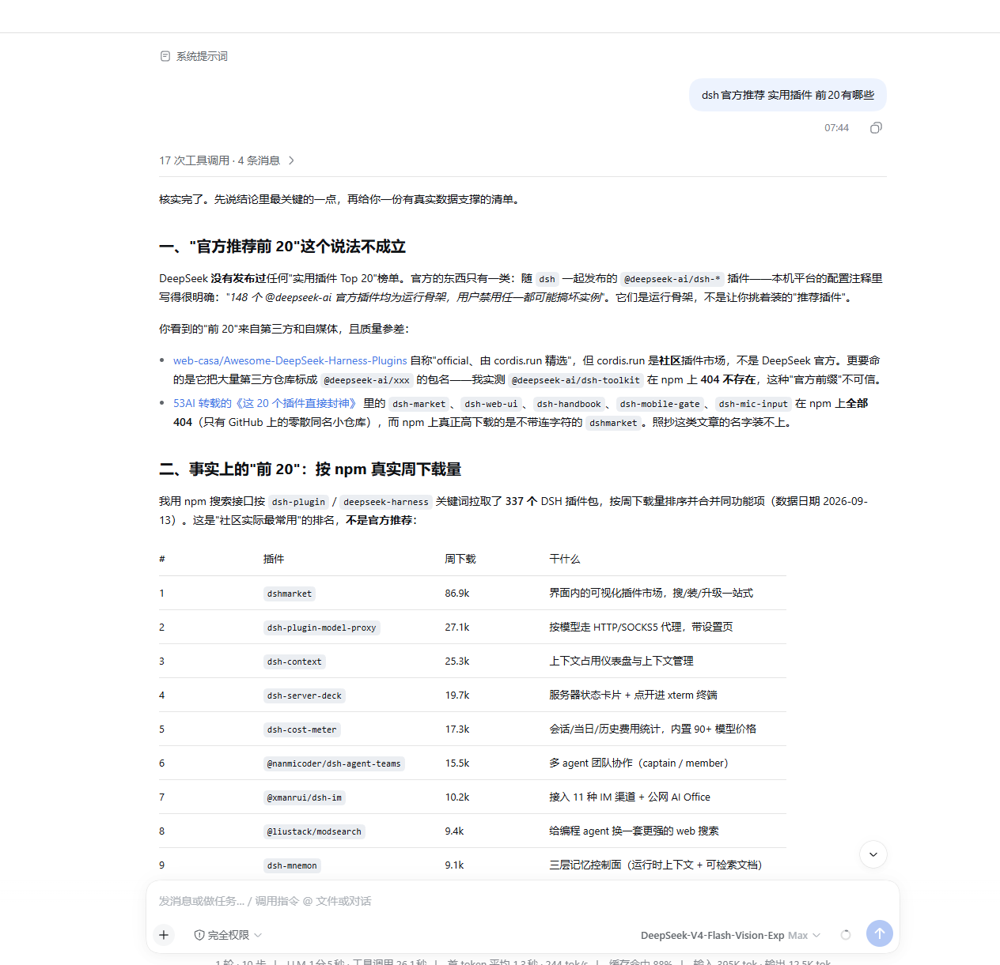

## 安装

**要求**：Linux（Debian/Ubuntu 或 RHEL 系）+ systemd + **root**、Node.js **^22.19 或 ≥24**；要完整能力还需要**一个域名 + 通配证书**。

有域名（推荐）：

```sh
git clone https://github.com/maogeigei/dsh-users-platform.git
cd dsh-users-platform
sudo CF_API_TOKEN=xxx bash install.sh --domain dsh.example.com --email you@example.com
```

无域名（只跑通链路；聊天界面打不开）：

```sh
sudo bash install.sh
```

验证：

```sh
systemctl is-active dsh-users-platform                    # 期望 active
curl -I http://dsh.example.com/                           # 期望 200（或 301 跳 https）
curl -I https://test.dsh.example.com/                     # 期望 401（未登录）
```

之后登录管理台、审核第一个用户，让他在网页桌面里启动 DSH。

> 🤖 **想让 AI agent 自己装？** 把 [install.zh-CN.md](install.zh-CN.md) 交给它 —— 那是分步指令，含每步校验与「不满足就停手」的判据。

👉 **详见 [manual/installation.zh-CN.md](manual/installation.zh-CN.md)**（DNS 记录、证书签发、两种方式对比、`nip.io` 演练、手动开发部署、关于域名的全部内容）· **环境变量见 [manual/configuration.zh-CN.md](manual/configuration.zh-CN.md)**

## 插件改造

托管平台和「本地跑」的假设**完全不同**：服务端的 `127.0.0.1` 是服务器，浏览器里的 `127.0.0.1` 是**用户自己的电脑**。很多插件本地好好的，一放上平台就废 —— 而且平台侧无法补救。

六个失败模式，各一句话：

| 模式 | 症状 | 改法 |
|---|---|---|
| **绝对 URL 交给浏览器** | 页面框架渲染了但内容永远白屏 —— **阻断级** | 改成同域相对路径 |
| **内部通信走 TCP loopback** | 插件自带服务起不来 | 改 unix domain socket 或 stdio |
| **自建网络监听** | 多租户互相干扰 | 复用 Host 的唯一入口 |
| **浏览器地址由客户端拼** | 同第一条 | 地址必须由 Host 生成且为相对路径 |
| **与平台内置包版本不兼容** | 实例崩溃循环 | 对齐依赖范围与导出符号 |
| **重型依赖在入口静态 import** | 一个插件吃掉实例六分之一内存 | 改 `await import()` 懒加载 |

还有更隐蔽的第七条：客户端插件的 `inject` 列了某个在该角色**永不下发**的 UI 包 ⇒ **永久挂起，无报错、无日志**。

👉 **含五条改造规范、完整实战与上架前自查清单：[PLUGIN-PORTING.zh-CN.md](PLUGIN-PORTING.zh-CN.md)**
📦 **改造示例：[examples/dsh-univer-office/](examples/dsh-univer-office/)** —— 改造补丁 + 新增模块 + 配套技能，附上游基线与应用方法。

## 版本更新说明

### v1.2.0 —— 2026-09-15 · 特性

- **集群模式** —— 控制面可以跨主机拆分运行：一个管理节点 + 若干工作节点，带**实例归属租约**（避免两台机器上的重启互相抢）、远程 spawner，以及用于文件与实例操作的 host-agent 通道。**单机模式不变，仍是默认**。
- **多语言运行时** —— 平台界面增加运行时 i18n 层，界面语言不再写死在页面里。
- **实例内「我的技能」分组** —— 由平铺列表改为分组展示。
- **修复** —— 部署模式解析器与类型声明现已一致，配置面从头到尾自洽。

### v1.1.0 —— 2026-09-14 · 特性

- **模型设置** —— 模型设置页复刻官方交互；官方推荐插件目录**按实际安装的 dsh 版本过滤**。
- **实例内存** —— 配额口径统一为一条规则（基础 448 MiB → 上限 1024 MiB），并与插件启用状态**解耦**：开关插件不再改变它报告的配额。
- **页面加载提速** —— 浏览器不再每次重下整包插件脚本（约 11 MB）：合并后的 `/plugins/` 脚本表现在带 `ETag`、命中即返回 `304`；HTML 外壳下发 `no-cache`，陈旧外壳不再把页面卡在「Failed to load plugins」。
- **代理加固** —— 回写时清理陈旧的 `dsh-auth` cookie，修掉表现为「Failed to load plugins」的 `431`。
- **单机部署** —— 平台发布的是单机后端，部署模式在启动阶段即已确定。

### v1.0.0 —— 2026-09-13 · 首个公开发布

- 首个公开快照：单机一键部署、每用户进程级隔离、崩溃自愈、插件与技能的受控管理。

## 致谢

- **DeepSeek Harness** —— [deepseek-ai/deepseek-harness](https://github.com/deepseek-ai/deepseek-harness)（**MIT**）。本项目不修改、不内嵌 DSH，只以子进程调用本机安装的 `dsh`。**感谢 DeepSeek 团队开源。**
- **`dsh-univer-office`** —— [dream-num/dsh-univer-office](https://github.com/dream-num/dsh-univer-office)（**Apache-2.0**），作者 **[dream-num](https://github.com/dream-num)**。它是插件移植指南背后的真实案例。**感谢作者与 Univer 社区** —— 能把一个 41 MB 的在线表格插件搬进托管环境，前提是有人先把它写出来。
- [examples/dsh-univer-office/](examples/dsh-univer-office/) 下的改造补丁与新增模块同样以 **Apache-2.0** 提供，以便与上游保持一致、方便合并回去。

## 授权

Copyright (C) 2026 maogeigei

本项目采用**双轨授权**。

**一 · 开源轨 —— GNU Affero General Public License v3.0**（默认）。全文见 [LICENSE](LICENSE)。

可自由使用、修改、分发，**包括商业用途**。传染性条款适用：若你分发本软件，或修改后以网络服务的形式提供给别人使用，需向这些使用者提供修改后的源码（AGPL-3.0 §13）。

**二 · 商业轨。** 若你希望**不受**上面的开源义务约束 —— 典型场景是运营闭源的托管服务，或把本软件嵌入专有产品 —— 可购买商业授权。适用场景与取得方式见 **[COMMERCIAL-LICENSE.zh-CN.md](COMMERCIAL-LICENSE.zh-CN.md)**。

请联系 **maogeigei@gmail.com** 洽谈条款与报价。
